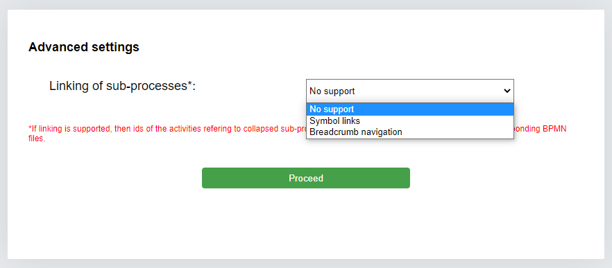

# Table of Content
1. [Overview](#Overview)

2. [Hardware and Software Requirements](#Hardware-and-Software-Requirements)
    
   2.1. [Hardware Requirements](#Hardware-Requirements)

    2.2. [Software Requirements](#Software-Requirements)

3. [Installation Procedure](#Installation-Procedure)

    3.1. [Eye-Tracking Server Installation](#Eye-Tracking-Server-Installation)

    3.2 [EyeMind App Installation](#EyeMind-App-Installation)

4. [Features](#Features)

# Overview

An integration of  [EyeMind](https://github.com/aminobest/EyeMind) with [OpenFace](https://github.com/TadasBaltrusaitis/OpenFace). Read the [paper](./paper.pdf) for details explaining background and the necessity of such a tool.

# Hardware and Software Requirements

### Hardware Requirements:
- Eyetracker with Tobii SDK access 
  (*Note: This application has only been tested with **Tobii Pro X3-120**, but it should work with other Tobii eyetrackers that support the SDK.*)
- Webcam

These devices must be connected to the computer running the application. Note that some Tobii eye-trackers require a connection to a USB 3 port.

### Software Requirements:
- **64-bit Windows 10 or 11**  
  *Note: Windows 11 is currently supported but will not be in future versions with wristband data*
- [**Python 3.8.6**](https://www.python.org/downloads/release/python-386/) (choose AMD64 for Win32)
- [**Pip**](https://phoenixnap.com/kb/install-pip-windows)
- [**NPM & Node.js**](https://nodejs.org/en/download/package-manager)
- [**Tobii 1.10.1 SDK**](https://pypi.org/project/tobii-research/1.10.1/)
- [**Tobii Eye Tracker Manager**](https://developer.tobiipro.com/eyetrackermanager/etm-installation-information.html)  
  - *For discontinued eyetrackers, download **Tobii Pro Eye Tracker Manager 2.6.1** instead from [here](https://connect.tobii.com/s/article/new-Tobii-Pro-SDK-and-ETM?language=en_US)*
- [**Visual Studio 2017**](https://visualstudio.microsoft.com/vs/older-downloads/)  
  *Alternatively, install the 64-bit Visual C++ Redistributable Package from [here](https://aka.ms/vs/16/release/vc_redist.x64.exe)*


# Installation Procedure

The EyeMind component composed of two services: the Eye-Tracking Server and the EyeMind App. This guide will walk you through the installation process for both services, as well as how to set up the OpenFace integration.

First, download the zip and extract the files.

### Eye-Tracking Server Installation

Follow the steps below to install the Eye-Tracking Server:


- **Navigate to the EyeTrackingServer folder:**

    ```
    cd \EyeMind\EyeTrackingServer
    ```

- **Install Python dependencies:** Once you are inside the EyeTrackingServer folder, install the required Python dependencies using the following command:

    ```
    pip install -r requirements.txt --user
    ```

- **Set Permissions:** Ensure the folder "\EyeTrackingServer\out\logs" has read and write permissions (chmod 777). The eye-tracking raw data will be recorded here. Preserve this data, as it could be useful for future recovery.


### EyeMind App Installation


- **Navigate to the EyeMind App folder:** 

    ```
    cd \EyeMind\EyeMindApp\
    ```

- **Install dependencies:** Install the necessary dependencies using the command:

    ```
    npm run install-dependencies
    ```

- **Build the app:** Build the EyeMind App using the following command:

    ```
    npm run build
    ```


# Features / How to Use
The EyeMind features is explained in the following video https://andaloussi.org/SoftwareX2023/demo.html. 

The added OpenFace functionality is incorporated behind the scenes, and its output data is found under the same output directory as the EyeMind functionality.

I have written a more detailed textual description below. The application is esssentially divided into two: Eye-tracking (setting up experiment, and conducting it) and Analysis (analysing the results (OpenFace comes in here), and preparing it for export). 


### Eye-Tracking


#### New Session
- Create a new experimental workflow:
- 
  - **Linking of sub-processes** (enables sub-processes):

    - Choose one (No support / Symbol links / Breadcrumb navigation)
      - The collapsed subprocesses should have the same ID as the sub-process file.

  - **Drop model files**:

    - Drag in `.bpmn` files you will use.
    - Drag them in the order you want them to appear (do not drag all at once).
    - Differentiate between main processes:
      - Divide models into groups by:
        - Set main `.bpmn`.
        - Set group numbers.

  - **Drop questions CSV files**:

    - Use the following CSV format:
      ```
      id,question,type,options,model-group
      1,"Question?",multiple-choice,Yes;No;I don't know,1
      2,"Question 2?",multiple-choice,Yes;No;I don't know,2
      ```
    - Field descriptions:
      - `id`: `<integer>`
      - `question`: `"string"`
      - `type`: `multiple-choice` / `open-question`
      - `options`: `<option 1>;<option 2>;<option 3> ...`
      - `model-group`: `<integer>`

  - Click the **record button** in the upper-right corner to save the workflow:
 

  - **Provide details**:
 
    - X screen dimension in pixels.
    - Y screen dimension in pixels.
    - Screen distance in centimeters.
    - Monitor size in inches.
    - Recording ID.
    - *(Optional)* Participant ID, Experiment ID, Experimenter ID.
    - Additional notes.

  - **Save session**:
    - Saves to an external file, which can be loaded using "Load Session."
    - Data is saved under `EyeMind/EyeMindApp/output data`.


#### Load Session
- Load a previous setup:
  - Saved sessions are stored in `\EyeMind\EyeMindApp\output data`.
  - Ensure:
    - The eye tracker is calibrated.
    - The eye-tracking server is running:
      ```bash
      <root path>\EyeMind\EyeTrackingServer
      python main.py
      ```
    - Participant ID is provided (through the recording button).

- Data is saved to `\EyeMind\EyeMindApp\output data`.

---


### Analysis
- Perform analysis on the dataset:

  - **Drop BPM EyeMind gaze files**:
    - Choose the JSON collected-data file(s) created during testing (from `\EyeMind\EyeMindApp\output data`).
    - Load files.

  - **Fixation detection**:

    - Follow the on-screen prompts.

  - **Gaze projection**:

    - Process data for projection.

  - **Heatmap**:

    - Note: Heatmap will not be enabled unless fixation detection is completed.

  - **Export**:

    - Choose which data you want to export:
      - Analysis file (`json`).
      - Gaze data (`csv`).
      - Fixation data (`csv`).

